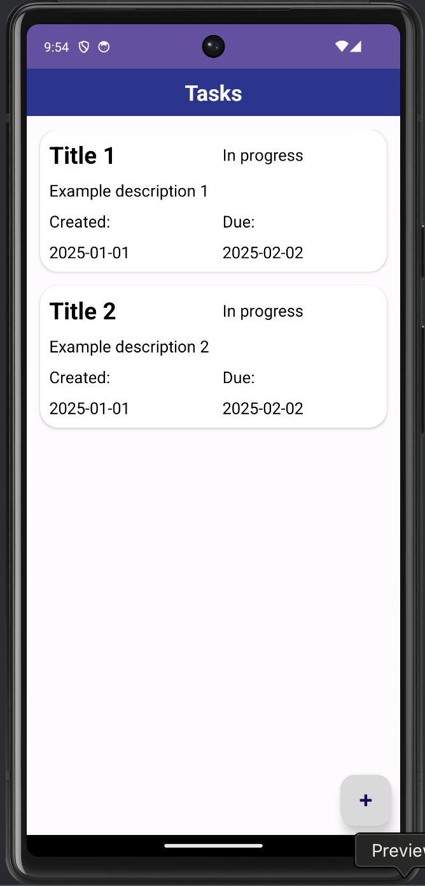
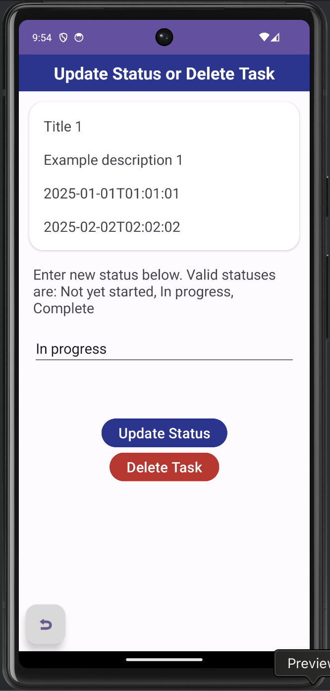
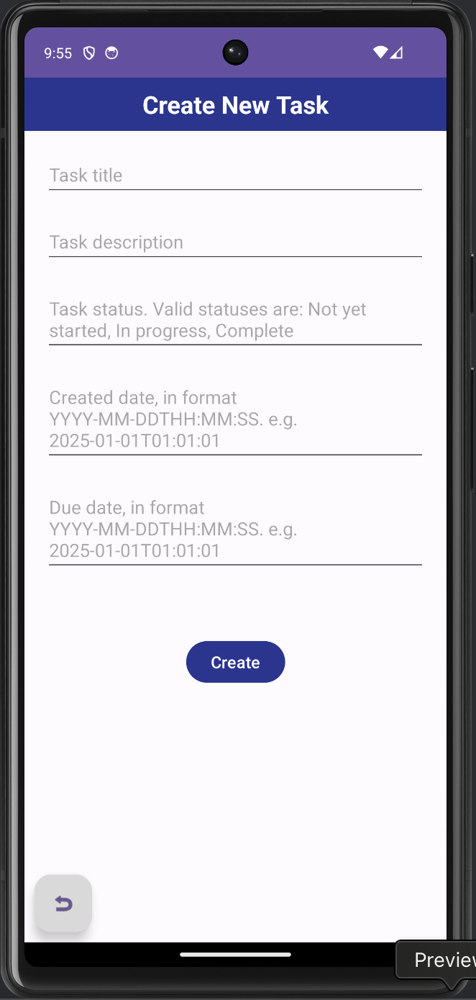

## Frontend Android app for DTS Coding Challenge
This is the frontend for a Case Manager app written for the DTS Coding Challenge. It allows users to create, view, update, and delete Tasks.

It was developed with an MVVM structure.

This application is written with using Android Studio, Java 17, and Retrofit for API calls.
Gradle is used for dependency management.

### Requirements
Java 17

Android Studio

### Running locally
Make sure you have the requirements listed above on your machine.
Compile and run the Java application on an emulated mobile device using Android Studio.

### Features
The app opens on the 'Tasks' page which displays all tasks.  From this page users can either:
- Navigate to the 'Update Status or Delete Task' page by clicking on the task they wish to update or delete
- Navigate to the 'Create Task' page by clicking the '+' floating action button in the bottom right corner

The 'Update Status or Delete Task' page displays details for the task selected on the 'Tasks' page.  From this page, users can:
- Update the selected task's status to the text supplied in the status edit text field (if a valid status is supplied), by clicking the 'Update' button
- Delete the selected task by clicking the 'Delete' button
- Navigate back to the 'Tasks' page without making any changes by clicking the back arrow floating action button in the bottom left corner

The 'Create Task' page displays edit text fields to create a new task.  From this page, users can:
- Create a new task with the values supplied in the edit text fields (if valid values are supplied), by clicking the 'Create' button
- Navigate back to the 'Tasks' page without making any changes by clicking the back arrow floating action button in the bottom left corner

